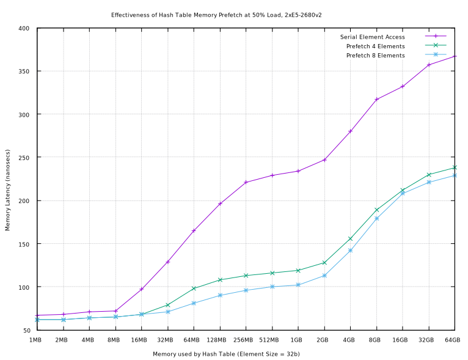

= Hashing for Free
:toc:

Using hashtable prefetches to hide memory latency.

The Prefetch Instruction
------------------------

One of the more difficult to use instructions is the prefetch code which allows
you to hide memory latency.  Memory latency can be significant, especially for
large in-memory databases, it is on the order of 100ns and is not decreasing
very much with each new CPU generation.  Around 4 hash codes can be computed in
the same time that a memory access completes.  The question is this:  Can the
hashing and the memory loads be pipelined such that hashing and memory fetching
are concurrent?

Hash Latency
------------

Using the MurmurHash2/a 64 bit hash routine designed by Austin Appleby
https://github.com/aappleby/smhasher/blob/master/src/MurmurHash2.cpp[(source)],
here is the latency of computing hashes for different sized keys:

[width="50%",options="header"]
|===========================================
|Size | Latency | Rate
|8b   |  17ns   | 57 M/s
|16b  |  20ns   | 51 M/s
|32b  |  24ns   | 42 M/s
|64b  |  27ns   | 36 M/s
|===========================================

Interleaving Hashing with Prefetching
-------------------------------------

In order to to allow the memory loads to occur at the same time as the hashing,
a pipeline of lookups can be created where the memory reference occurs as the
hashing is performed.  I've found that the pipeline of 4 lookups is close to
optimal.  The psuedo-code below is used to benchmark the prefetch instruction
in the next section.

--------------------------
h1 = compute( key1 ) % ht-size ; prefetch( ht[ h1 ] )
h2 = compute( key2 ) % ht-size ; prefetch( ht[ h2 ] )
h3 = compute( key3 ) % ht-size ; prefetch( ht[ h3 ] )
h4 = compute( key3 ) % ht-size ; prefetch( ht[ h4 ] )

access( ht[ h1 ] )->put( key1, "hello" )
access( ht[ h2 ] )->put( key2, "hello" )
access( ht[ h3 ] )->put( key3, "hello" )
access( ht[ h4 ] )->put( key4, "hello" )
--------------------------

The effect of this hides the memory accesses while computing the hashes.  This
works as long as the hashtable is larger than the Level 3 CPU cache,
necessitating a main memory access much of the time.  When the hashtable fits
within the Level 3 CPU cache, the effect of prefetching has slight benefits.

A Micro Benchmark
-----------------

Here are some micro benchmarks on an Ivy Bridge e5-2680v2, a CPU which has 25MB
L3 caches.  This test is filling up 50% of the elements using 2^N^ hash table
sizes.  I did not go beyond 64GB because that is 50% of ram and I used Posix
shared memory to allocate the hash table.

[width="100%",options="header"]
|===========================================
|HT size| 50% elems  | Latency | Rate    | Prefetch4 | Rate4     | Prefetch8
| 1MB   |      14K   |   67ns  |  15 M/s |    62ns   |   16 M/s  |    62ns
| 2MB   |      31K   |   68ns  |  11 M/s |    62ns   |   16 M/s  |    62ns
| 4MB   |      63K   |   71ns  |  11 M/s |    64ns   |   16 M/s  |    64ns
| 8MB   |     129K   |   72ns  |  11 M/s |    65ns   |   15 M/s  |    65ns
| 16MB  |     260K   |   97ns  |  10 M/s |    68ns   |   15 M/s  |    68ns
| 32MB  |     522K   |  129ns  | 7.8 M/s |    79ns   |   13 M/s  |    71ns
| 64MB  |    1,047K  |  165ns  | 6.0 M/s |    98ns   |   10 M/s  |    81ns
| 128MB |    2,095K  |  196ns  | 5.1 M/s |   108ns   |  9.2 M/s  |    90ns
| 256MB |    4,192K  |  221ns  | 4.5 M/s |   113ns   |  8.8 M/s  |    96ns
| 512MB |    8,387K  |  229ns  | 4.3 M/s |   116ns   |  7.3 M/s  |   100ns
| 1GB   |   16,775K  |  234ns  | 4.3 M/s |   119ns   |  8.4 M/s  |   102ns
| 2GB   |   33,552K  |  247ns  | 4.1 M/s |   128ns   |  7.8 M/s  |   113ns
| 4GB   |   67,107K  |  280ns  | 3.7 M/s |   156ns   |  6.4 M/s  |   142ns
| 8GB   |  134,216K  |  317ns  | 3.2 M/s |   189ns   |  5.2 M/s  |   179ns
| 16GB  |  268,433K  |  342ns  | 3.0 M/s |   212ns   |  4.7 M/s  |   208ns
| 32GB  |  536,869K  |  357ns  | 2.8 M/s |   230ns   |  4.3 M/s  |   221ns
| 64GB  | 1,054,030K |  367ns  | 2.7 M/s |   238ns   |  4.2 M/s  |   229ns
|===========================================

* MB = 2^20^, GB = 2^30^, K = 1000, M/s = 10^6^/second

All of these were done on CPU core #0 using the turbo frequency of 3.6ghz.  The
first latency and rate is the timing without batching lookups, the prefetch4
and rate4 are using the pipeline described above, prefetch8 is a pipeline of 8
lookups using the same algo.  The latency reported for prefetch4 is an average
over all the items, the actual latency for an individual element may be 4 times
that, since disrupting the caches by using an individual item before the
prefetched items are completed would risk throwing away the data in flight from
main memory.  If the usage of the item does not cause cache flushing, then more
CPU work could be done while memory is being a sloth.

There are latency gains for prefetching 2 at a time and 3 at a time, as well as
5 or more, so the best trade off may be eating the available lookups as they
are queued and for clients to group accesses when possible, optimizing the
CPU memory accesses.

The timings above use linear probing on a hash table that is 50% full, so the
number of elements required to compare each key are about 1.5 memory locations.
The access of elements inserted into the table at the end of the tests usually
added 10ns of time because the likelyhood of collision is higher, so the
variance between the recorded time and the actual times was about +-5ns.  Each
entry is 32b large and the keys are 8 byte incrementing integers, about as low
of an overhead as is possible.  Putting the value "hello" into the table can
fit within the 32b element and does not require a second level memory access.
The put operation has about 20ns overhead for each element.

Pipelining the second level access is not presented here.  I also did not test
with TLB magic using hugetblfs.  Numa memory node mapping was set to interleave
in BIOS.  Node to node memory accesses can add significant memory latency,
which seems to be on the order of 20ns with prefetching and 70ns without
prefetching in my testing.  See Joe Chang for more:
http://sqlblog.com/blogs/joe_chang/archive/2016/12/18/memory-latency-and-numa.aspx[Memory
Latency and Numa]

The 32b element size was chosen so that 64b cache lines are not crossed, but
more elements can be packed together.
